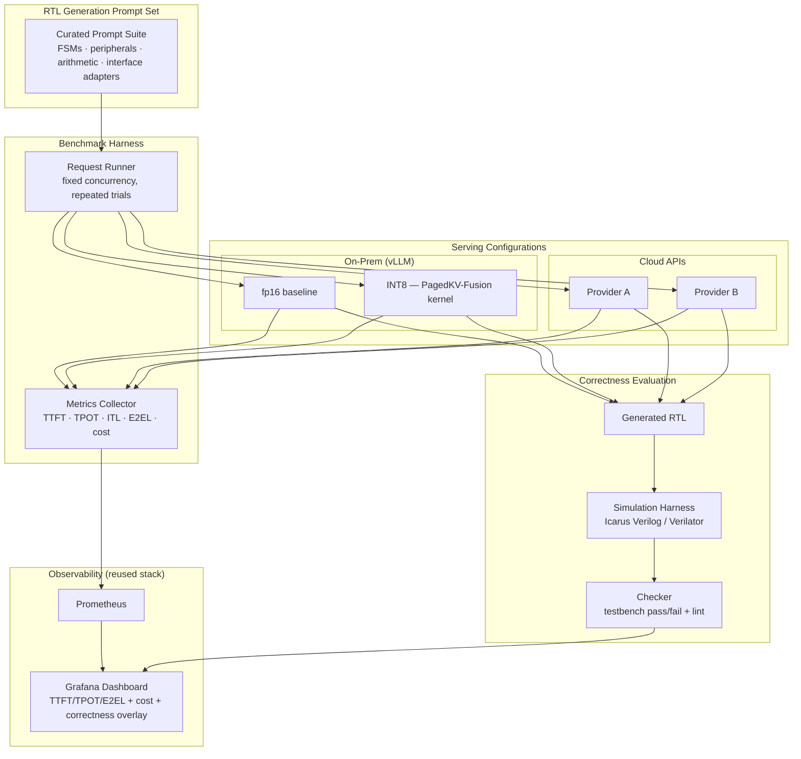

# Chip-Design LLM Benchmark Suite
## Quantifying the Latency, Throughput, and Correctness Tradeoffs of LLM-Assisted RTL Generation

**Project Proposal**
**Author:** Archana Chetan
**Date:** July 2026
**Status:** Proposed — Portfolio / Applied Research Project

---

## 1. Executive Summary

The Chip-Design LLM Benchmark Suite answers a concrete, currently under-published question: **what does it actually cost — in latency, throughput, and correctness — to use an LLM to generate RTL (Verilog/SystemVerilog) snippets, on-prem versus cloud, across different quantization levels?**

This project repurposes two existing systems directly: the **LLM Inference Benchmarking Dashboard** (real-time TTFT/TPOT/ITL/E2EL metrics scraped from vLLM's Prometheus endpoint and NVIDIA DCGM) and **PagedKV-Fusion** (custom CUDA kernels for INT8 quantized paged attention, with measured ~21x throughput gains and ~50% KV memory savings versus fp16). Rather than building new infrastructure, this project **applies existing, already-benchmarked infrastructure to a new evaluation target** — RTL code generation — and closes an open question neither the LLM-benchmarking community nor the EDA community has rigorously published on: does quantizing the model change the *correctness* of the RTL it generates, not just its speed.

**Why this matters for hiring managers:** most public LLM benchmarks measure general code generation (HumanEval, MBPP) or general chat latency. Almost no one publishes real, reproducible numbers specifically on RTL generation cost/latency/correctness tradeoffs — and even fewer people bring hands-on CUDA-level quantization kernel experience to the correctness question, rather than treating quantization as a black-box speed knob. That combination — inference-infra rigor plus quantization-kernel depth plus RTL-specific evaluation — is a genuinely rare intersection.

---

## 2. Problem Statement

Semiconductor design teams are increasingly experimenting with LLMs to accelerate RTL authoring — generating boilerplate interface code, FSM skeletons, assertion stubs, and testbench scaffolding. Two decisions recur in every deployment conversation, and neither is well-answered by existing public data:

**Decision 1 — Where to run it:** On-prem GPU serving (predictable cost, data stays in-house, capital expense) versus cloud API/managed inference (elastic, no infra ownership, per-token cost, potential IP/confidentiality concerns for proprietary RTL). Teams need real TTFT/throughput/cost numbers to make this tradeoff, not vendor marketing claims.

**Decision 2 — How aggressively to quantize:** Quantization (INT8, and increasingly lower-bit schemes) is well understood to improve throughput and reduce memory footprint for general-purpose LLM serving. What is *not* well established is whether quantization measurably degrades the **functional correctness** of generated RTL specifically — RTL is unusually unforgiving of subtle token-level errors (an off-by-one in a bit-width, a swapped comparison operator, a missing sensitivity-list signal) in a way that natural-language generation tolerates much better. A model can be "close enough" in prose; RTL either simulates correctly or it doesn't.

**Core hypothesis:** on-prem serving with INT8 quantization can deliver substantially better cost/latency characteristics for RTL generation workloads than cloud APIs, but the correctness cost of quantization — measured by actual simulation pass/fail, not just perplexity or BLEU-style text similarity — needs to be measured explicitly rather than assumed negligible.

---

## 3. Objectives

| Objective | Success Criterion |
|---|---|
| Benchmark TTFT/TPOT/E2EL for RTL generation, on-prem vs. cloud | Real measured latency/throughput numbers across ≥2 on-prem configs and ≥2 cloud API providers, same prompt set |
| Benchmark cost per generated RTL module | $/module and $/1K tokens computed from real infra pricing, not estimates |
| Measure quantization impact on generation *speed* | TTFT/throughput deltas across fp16, INT8, and (if feasible) lower-bit quantization, reusing PagedKV-Fusion kernels where applicable |
| Measure quantization impact on generation *correctness* | Pass/fail rate on a real RTL correctness benchmark (simulated via Icarus Verilog/Verilator), compared across quantization levels — not inferred from text similarity |
| Publish a fully reproducible, honest report | Every number backed by a script; explicit confidence intervals; no cherry-picked runs |

---

## 4. Non-Goals (Explicitly Out of Scope)

- **Not** claiming any single model or quantization scheme is universally "best" — results are scoped to the specific models, hardware, and RTL task types tested
- **Not** using any proprietary, employer-owned, or NDA-covered RTL as prompts or evaluation targets — all evaluation RTL sourced from open-source hardware projects or newly authored, clearly original small modules
- **Not** attempting full SoC-scale RTL generation — scope is small, well-specified modules (FSMs, simple peripherals, arithmetic blocks, interface adapters) where correctness can be objectively simulated and checked
- **Not** a general LLM-serving cost calculator — this is a focused, RTL-specific benchmark, not a general-purpose infra cost tool (that already exists in the form of the AI-Infrastructure-Copilot capacity-planning work)
- **Not** claiming production-grade statistical power — sample sizes will be explicitly reported, and this is framed as an early-stage empirical study, not a definitive industry benchmark

---

## 5. System Architecture

### 5.1 RTL Generation Prompt Set
A curated suite of ~40–60 prompts spanning task categories chosen specifically because correctness is **objectively checkable by simulation**, not subjective:
- Finite state machines (traffic light controller, simple protocol handshake FSM)
- Common peripherals (UART transmitter/receiver, SPI slave, simple FIFO)
- Arithmetic blocks (parameterized adder/multiplier, saturating counter)
- Interface adapters (AXI-lite register block, clock-domain-crossing synchronizer)

Each prompt is paired with a hand-written or open-source reference testbench that can pass/fail the generated RTL automatically.

### 5.2 Serving Configurations
- **On-prem fp16 baseline:** vLLM serving an open-weight coding model at full precision — reuses existing vLLM infra
- **On-prem INT8:** same model served through the PagedKV-Fusion quantized paged-attention backend, directly reusing the already-benchmarked kernel work (prior measured: ~21x throughput vs. gathered fp16 SDPA, ~50% KV memory savings)
- **Cloud API providers:** at least two commercial coding-capable LLM APIs, tested under equivalent prompt/concurrency conditions

### 5.3 Benchmark Harness
Directly extends the LLM Inference Benchmarking Dashboard's collection approach: fixed-concurrency repeated trials per configuration, scraping TTFT/TPOT/ITL/E2EL from vLLM's `/metrics` endpoint for on-prem runs, and instrumenting equivalent client-side timing for cloud API calls (since cloud providers don't expose the same Prometheus surface). Cost is computed per configuration from real published pricing (cloud) or measured GPU-hour cost (on-prem).

### 5.4 Correctness Evaluation
The differentiated core of this project. Every generated RTL snippet is:
1. Linted (basic syntax/style check)
2. Compiled and simulated against its paired reference testbench using Icarus Verilog or Verilator (open-source, no commercial EDA license needed)
3. Scored pass/fail, with failure category recorded (syntax error, simulation mismatch, timeout, non-synthesizable construct)

This produces a real, simulation-grounded correctness signal per quantization level — not a proxy metric like text similarity or perplexity, which prior general-purpose LLM quantization studies typically rely on and which do not reliably predict RTL functional correctness.

---

## 6. Technology Stack

| Layer | Technology |
|---|---|
| Serving (on-prem) | vLLM, PagedKV-Fusion CUDA kernels (reused) |
| Serving (cloud) | Commercial coding-LLM APIs (via standard HTTP clients) |
| Benchmark harness | Python, reused patterns from LLM-Inference-Benchmarking-Dashboard |
| Correctness evaluation | Icarus Verilog, Verilator, custom pass/fail checker |
| Observability | Prometheus, Grafana, NVIDIA DCGM (on-prem GPU metrics) |
| CI/CD | GitHub Actions, pytest |
| Cost modeling | Published cloud API pricing + measured on-prem GPU-hour cost |

---

## 7. Evaluation Methodology

Consistent with the honest-validation discipline already demonstrated in PagedKV-Fusion (explicit hardware disclosure — "benchmarks measured on NVIDIA T1000 8GB, CUDA 12.5" — and recommending datacenter GPU numbers before citing production SLOs):

**Benchmark protocol:**
1. Fix the prompt suite (~40–60 tasks) and run each configuration (fp16 on-prem, INT8 on-prem, 2x cloud APIs) with a fixed number of repeated trials (e.g., 5 runs per prompt per configuration) to capture variance, not single-shot numbers
2. Record full latency distributions (P50/P95/P99 for TTFT, TPOT, E2EL), not just averages
3. Record cost per module generated, normalized to $/1K output tokens and $/module
4. Run every generated RTL snippet through the simulation harness; record pass/fail and failure category
5. Report quantization's effect on correctness as a **paired comparison**: for the same prompt, does fp16 pass where INT8 fails (or vice versa)? — this isolates quantization's effect from prompt difficulty variance
6. Publish `VALIDATION_REPORT.md` with: exact hardware/model/quantization configuration used, full latency distributions, cost tables, correctness pass rates per configuration, and an explicit list of paired-comparison failures with the actual generated code diffs

**Explicit hardware disclosure requirement:** all latency/throughput numbers will state the exact GPU used, and — following the PagedKV-Fusion precedent — will explicitly flag if consumer-grade hardware was used, recommending datacenter GPU validation before citing the numbers as production SLOs.

---

## 8. Milestones & Timeline

| Phase | Deliverable | Est. Duration |
|---|---|---|
| 1. Prompt suite design | 40–60 RTL generation prompts + paired reference testbenches | 1.5 weeks |
| 2. Correctness harness | Icarus Verilog/Verilator integration, automated pass/fail checker | 1 week |
| 3. On-prem serving setup | fp16 baseline + INT8 (PagedKV-Fusion) vLLM configs | 3–4 days (largely reused infra) |
| 4. Cloud API integration | Client harness for ≥2 cloud coding-LLM APIs, equivalent prompt/concurrency handling | 3–4 days |
| 5. Benchmark execution | Full run matrix (configs × prompts × repeated trials) | 1 week |
| 6. Correctness analysis | Paired-comparison analysis, failure categorization | 1 week |
| 7. Validation report & dashboard | `VALIDATION_REPORT.md`, Grafana dashboard combining latency/cost/correctness views | 1.5 weeks |

**Total estimated timeline: ~7–8 weeks part-time** (shorter than other proposals, since serving and dashboard infrastructure is directly reused rather than newly built)

---

## 9. Risks & Mitigations

| Risk | Mitigation |
|---|---|
| Small on-prem hardware (e.g., consumer GPU) doesn't reflect datacenter-scale numbers | Explicitly disclose hardware used in every reported number, following the PagedKV-Fusion precedent; frame results as directional, not production SLOs |
| Cloud API rate limits or pricing changes mid-benchmark | Run all configurations within a tight time window; snapshot pricing pages as of the benchmark date in the report |
| Correctness differences driven by prompt difficulty rather than quantization | Use paired comparison (same prompt, same seed where possible, only quantization level varies) to isolate the quantization effect specifically |
| Small sample size (40–60 prompts) limits statistical confidence | Report confidence intervals explicitly; frame conclusions as "observed in this sample" rather than general claims about quantization and RTL correctness |
| RTL correctness evaluation infrastructure (Verilator/Icarus) has its own quirks (non-synthesizable constructs, simulator-specific behavior) | Validate the reference testbenches against known-correct hand-written RTL first, to confirm the harness itself is trustworthy before evaluating LLM output |

---

## 10. Relevance to Target Role

This project is designed to showcase a specific, high-value intersection rarely found in one candidate — genuine LLM-inference infrastructure depth combined with hands-on quantization-kernel experience, applied to a real open question in the silicon-AI space:

- **Direct reuse of already-benchmarked infrastructure** (LLM-Inference-Benchmarking-Dashboard, PagedKV-Fusion) — demonstrates the ability to apply existing systems to new problems efficiently, rather than starting from zero every time
- **Rare, credible technical depth on quantization correctness** — most quantization discussions stop at throughput/memory; this project's CUDA-kernel background gives real standing to speak to correctness tradeoffs specifically
- **Statistical and experimental rigor** — paired comparison methodology, explicit confidence intervals, and honest hardware disclosure mirror the same discipline already demonstrated in the A/B-testing portfolio
- **Directly answers a live, unresolved question** in LLM-assisted chip design — "should we quantize the coding model we use for RTL generation, and does it cost us correctness" — that most public benchmarks simply don't address
- **Cost/latency tradeoff framing (on-prem vs. cloud)** — mirrors real infrastructure decision-making that silicon teams evaluating LLM-assisted workflows are actively facing right now

---

## 11. Appendix: Reference Points for Correctness Evaluation

- [Icarus Verilog](https://github.com/steveicarus/iverilog) — open-source Verilog simulator, sufficient for small-module correctness checking
- [Verilator](https://github.com/verilator/verilator) — faster, more production-grade open-source simulator, useful as a cross-check against Icarus results
- Open-source small RTL modules (UART, SPI, FIFO reference implementations) as design inspiration for prompt construction and as sanity-check baselines for the correctness harness itself

---

*This proposal follows the same documentation and validation standards as prior published work (PagedKV-Fusion, LLM-Inference-Benchmarking-Dashboard) — every latency, cost, and correctness claim will be backed by a reproducible script with explicit hardware disclosure, and no result will be presented without stating its sample size and limitations.*
