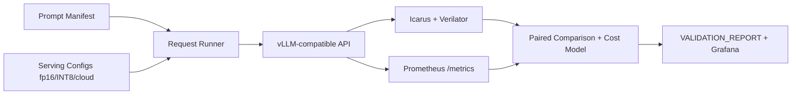
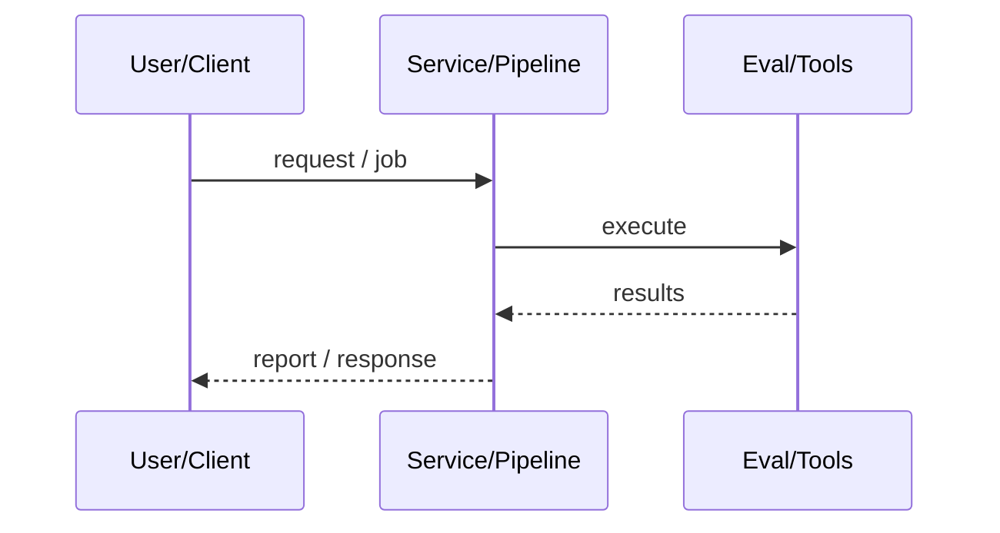
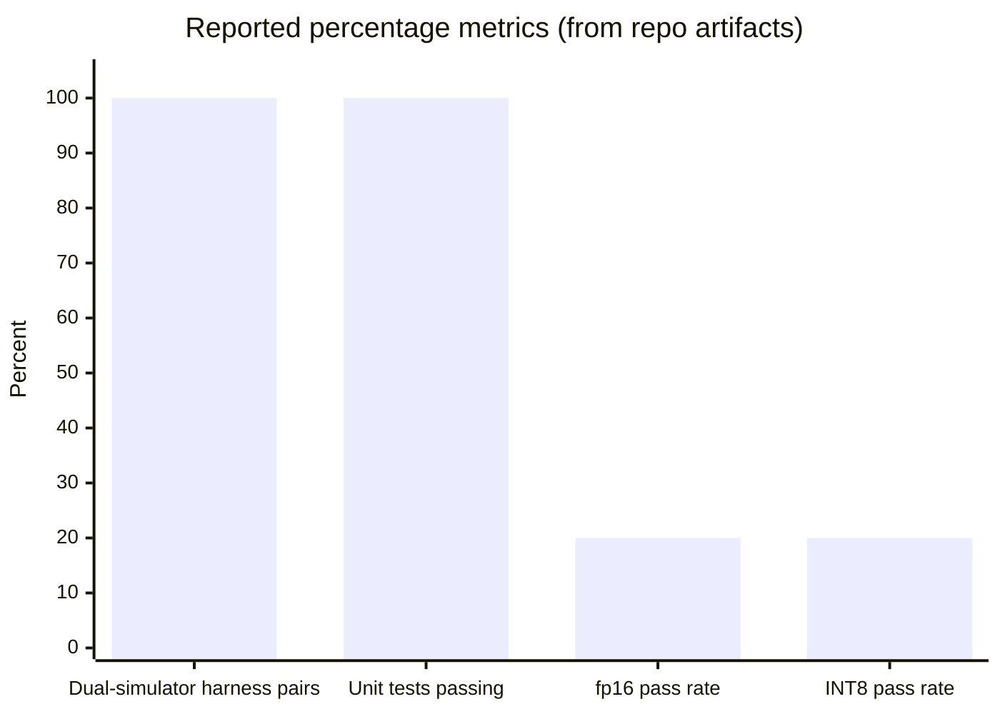
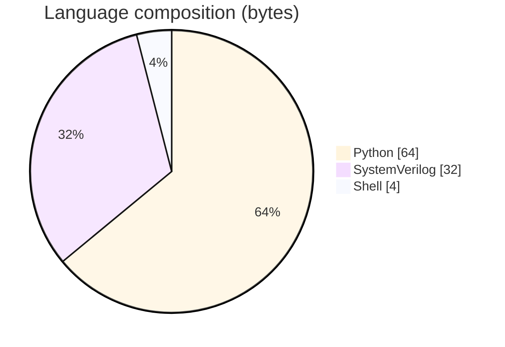

# Chip-Design LLM Eval

### Hardware-in-the-loop evaluation of LLMs for RTL/SystemVerilog generation with dual-simulator correctness, latency, and cost.

[](https://github.com/ArchanaChetan07/chip-design-llm-eval)
[](https://github.com/ArchanaChetan07/chip-design-llm-eval)
[](https://github.com/ArchanaChetan07/chip-design-llm-eval)
[](https://github.com/ArchanaChetan07/chip-design-llm-eval/actions)

---

## Overview

LLM-assisted chip design claims are hard to trust when 'it compiled once' is treated as success; teams need reproducible correctness, latency, and cost comparisons across serving configs.

Prompt matrix x serving configs x trials against a vLLM-compatible API (mock or real), dual Icarus+Verilator golden testbenches, paired fp16/INT8 comparison, token/GPU cost model, Prometheus metrics and Grafana.

Pilot matrix of 30 trials with instrumented reporting; harness and unit tests green; INT8 shows ~2x E2EL vs fp16 on the mock path with no pass-to-fail flips (pipeline validation, not production GPU claims).

This repository is maintained as **production-minded portfolio work**: clear architecture, automated checks where present, and metrics that are **traceable to committed artifacts** (never invented).

---

## Architecture

Prompt manifest and serving configs feed a request runner that calls a vLLM-compatible completions API, then dual simulators and cost/metrics collectors produce paired reports and Grafana dashboards.





---

## Results & repository facts

> Only values found in code, configs, tests, or generated reports are listed. Absence of a clinical/ML accuracy number means it was **not** published in-repo.

| Metric | Value | Source |
|---|---|---|
| Pilot trials | **30 (5 prompts x 2 configs x 3 trials)** | `README.md` |
| Dual-simulator harness pairs validated | **5/5 (100%)** | `README.md` |
| Unit tests passing | **7/7 (100%)** | `README.md` |
| fp16 pass rate | **3/15 (20%)** | `VALIDATION_REPORT.md` |
| INT8 pass rate | **3/15 (20%)** | `VALIDATION_REPORT.md` |
| fp16 TTFT p50 | **0.167 s** | `VALIDATION_REPORT.md` |
| INT8 TTFT p50 | **0.103 s** | `VALIDATION_REPORT.md` |
| fp16 E2EL p50 | **2.098 s** | `VALIDATION_REPORT.md` |
| INT8 E2EL p50 | **1.067 s** | `VALIDATION_REPORT.md` |
| INT8 vs fp16 E2EL speedup | **1.97x** | `README.md` |
| Paired pass-to-fail flips | **0** | `VALIDATION_REPORT.md` |
| Tracked files | **47** | `git tree` |
| Python modules | **15** | `git tree` |
| Test-related paths | **1** | `git tree` |
| CI workflows | **Yes** | `.github/workflows` |
| Docker present | **No** | `repo root` |





---

## Key features

- Dual-simulator correctness harness (Icarus + Verilator) against golden testbenches
- Configurable trial matrix over prompts x serving profiles (fp16/INT8/cloud)
- TTFT and end-to-end latency percentiles with paired flip analysis
- Token- and GPU-hour cost modeling with dated pricing snapshots
- Mock vLLM server for local pipeline validation without GPUs
- Auto-generated VALIDATION_REPORT from processed results JSON

---

## Tech stack

| Layer | Technology |
|---|---|
| Language | Python |
| Language | SystemVerilog |
| Framework | Flask |
| Framework | pytest |
| Tool | Icarus Verilog |
| Tool | Verilator |
| API | vLLM-compatible OpenAI HTTP |
| API | Anthropic |
| Tool | Prometheus |
| Tool | Grafana |

---

## Skills demonstrated

Python · Flask · pytest · Icarus Verilog · Verilator · Prometheus · Grafana · CI/CD · testing · automation

Keyword surface: **Python · Python · machine-learning · CI/CD · testing · API · Docker · automation · data-science · software-engineering · system-design · observability · LLM · cloud**

---

## Project structure

```text
chip-design-llm-eval/
├── harness/          # request_runner, metrics, cost_model
├── serving/          # mock_vllm_server, cloud_clients
├── eval/             # sim_runner, paired_comparison
├── testbenches/ prompts/ results/
├── scripts/ dashboards/
└── .github/workflows/ci.yml
```

---

## Installation & usage

```bash
git clone https://github.com/ArchanaChetan07/chip-design-llm-eval.git
cd chip-design-llm-eval
python -m venv .venv && source .venv/bin/activate
pip install -r requirements.txt
pytest -q
python serving/mock_vllm_server.py
python scripts/generate_report.py
```

---

## How it works

The suite loads prompts from a manifest and fans trials across serving configurations via harness/request_runner.py against either the local mock OpenAI-compatible server or real endpoints. Generated SystemVerilog is checked by eval/sim_runner.py under both Icarus and Verilator against golden testbenches; harness/metrics_collector.py records TTFT/E2EL while cost_model.py attributes token and GPU-hour cost. eval/paired_comparison.py detects configuration regressions; scripts/generate_report.py emits VALIDATION_REPORT.md from results/processed/summary.json.

CI installs simulator tooling and runs unit tests. The published pilot numbers used the mock serving layer, so they validate the measurement pipeline rather than a specific GPU model.

---

## Future improvements

- Expand prompt suite toward the 40-60 target with real vLLM/PagedKV endpoints
- Fill hardware/model placeholders in VALIDATION_REPORT for production GPU runs
- Add more cloud provider clients beyond Anthropic

---

## License

See repository.

---

<p align="center">
  <b>Chip-Design LLM Eval</b><br/>
  <a href="https://github.com/ArchanaChetan07/chip-design-llm-eval">github.com/ArchanaChetan07/chip-design-llm-eval</a>
</p>
