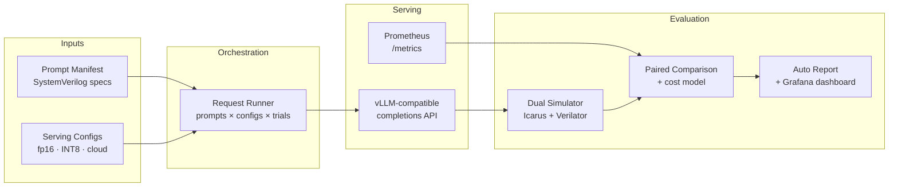
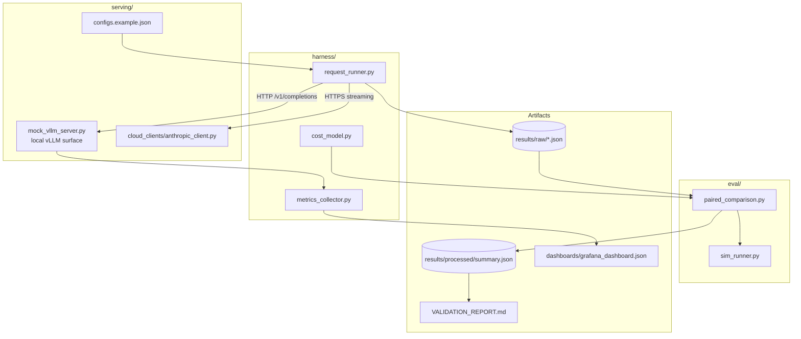
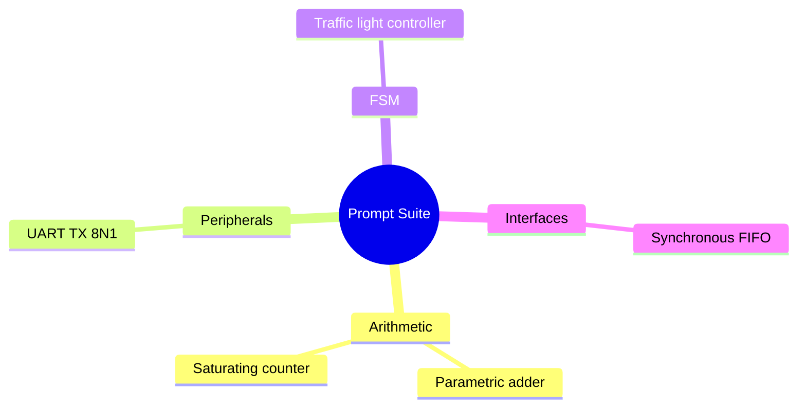
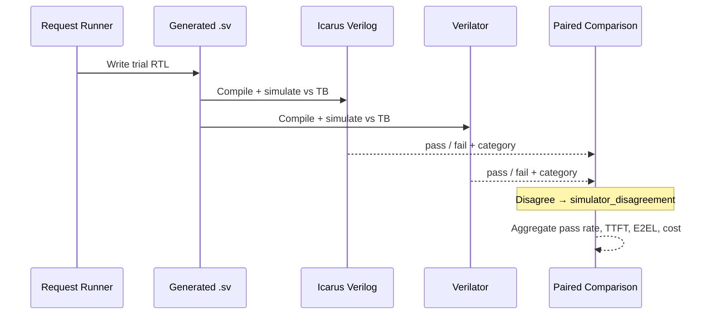
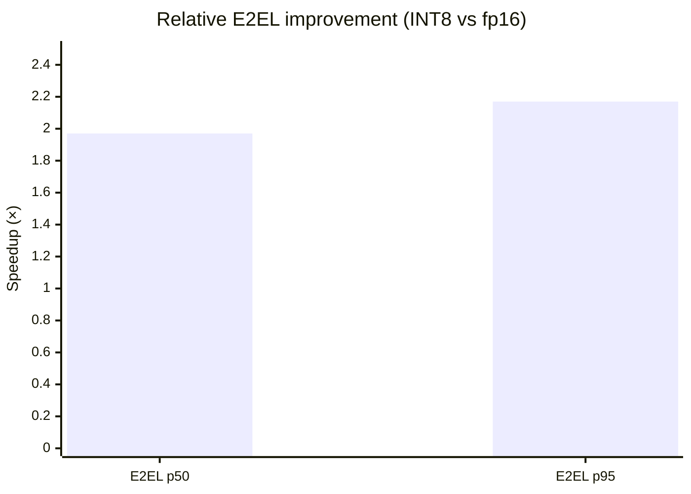
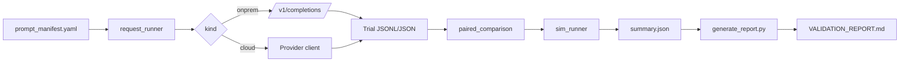

# Chip-Design LLM Eval

**Hardware-in-the-loop evaluation of large language models for RTL generation** — measuring functional correctness, latency, and cost across on-prem and cloud serving configurations.

[](https://github.com/ArchanaChetan07/chip-design-llm-eval/actions/workflows/ci.yml)
[](#tech-stack)
[](#benchmark-coverage)
[](#correctness-harness)
[](#results-in-numbers)
[](#results-in-numbers)

---

## Results in numbers

| Metric | Value |
|---|---:|
| Prompt categories covered | **4** (arithmetic, peripherals, FSM, interfaces) |
| Pilot prompts | **5** |
| Serving configs compared | **2** (fp16, INT8) |
| Trials per prompt × config | **3** |
| Total trials in latest matrix | **30** (`5 × 2 × 3`) |
| Dual-simulator harness pairs validated | **5 / 5** (100%) |
| Unit tests passing | **7 / 7** (100%) |
| fp16 trials passed | **3 / 15** (20%) |
| INT8 trials passed | **3 / 15** (20%) |
| fp16 TTFT p50 | **0.167 s** |
| INT8 TTFT p50 | **0.103 s** |
| fp16 E2EL p50 | **2.098 s** |
| INT8 E2EL p50 | **1.067 s** |
| INT8 vs fp16 TTFT speedup | **1.63×** |
| INT8 vs fp16 E2EL speedup | **1.97×** |
| Paired pass→fail flips (fp16 ↔ INT8) | **0** |
| Failure category (both configs) | **12** syntax_error per config |

---

### At a glance

| Axis | What this suite measures |
|---|---|
| **Correctness** | Generated SystemVerilog against dual-simulator golden testbenches |
| **Latency** | TTFT & end-to-end latency (p50 / p95) per serving profile |
| **Cost** | Token- and GPU-hour aware cost model for cloud and on-prem |
| **Regression** | Paired trial analysis to detect pass→fail flips between configs |

---

## Why it exists

LLM-assisted chip design is accelerating — but “it compiled once” is not a metric. This repository is an **end-to-end evaluation lab** for comparing:

- **On-prem fp16** baselines (vLLM-compatible HTTP API)
- **On-prem INT8 / KV-cache optimized** serving (PagedKV-Fusion class configs)
- **Cloud LLM APIs** (Anthropic client included; provider registry is extensible)

…under a shared prompt suite, shared simulators, and reproducible reporting.



---

## System architecture



**Design principle:** the orchestration layer speaks a **vLLM-shaped HTTP contract**. Swap local adapters for production endpoints with **zero changes** to the request matrix runner.

---

## Benchmark coverage

Pilot prompt suite spans four digital-design categories, each with validated known-good / known-broken DUT pairs:



| Category | Modules under test | Difficulty band |
|---|---|---|
| Arithmetic | `adder`, `sat_counter` | Trivial → Moderate |
| Peripherals | `uart_tx` | Moderate |
| Finite-state machines | `traffic_fsm` | Moderate |
| Interface adapters | `sync_fifo` | Moderate → Hard |

Harness trust check: every known-good DUT **passes**, every known-broken DUT **fails with the expected failure class** (`scripts/validate_testbenches.py`).

---

## Correctness harness

Generated RTL is compiled and simulated on **two independent open-source simulators** so single-tool false positives are caught:



Failure taxonomy includes compile errors, simulation mismatches, timeouts, harness errors, and simulator disagreement — enabling apples-to-apples debugging across models and quantizations.

---

## Pilot results (latest local matrix)

Source run: `results/raw/raw_results_171b5117.json` → `results/processed/summary.json`  
Matrix size: **5 prompts × 2 configs × 3 trials = 30 trials**

### Latency — fp16 vs INT8

```mermaid
xychart-beta
  title "Latency percentiles (seconds) — lower is better"
  x-axis ["TTFT p50", "TTFT p95", "E2EL p50", "E2EL p95"]
  y-axis "Seconds" 0 --> 2.5
  bar [0.167, 0.232, 2.098, 2.373]
  bar [0.103, 0.128, 1.067, 1.092]
```



| Config | Trials | Passed | Pass rate | TTFT p50 | TTFT p95 | E2EL p50 | E2EL p95 |
|---|---:|---:|---:|---:|---:|---:|---:|
| **fp16** | 15 | 3 | 20% | 0.167 s | 0.232 s | 2.098 s | 2.373 s |
| **INT8** | 15 | 3 | 20% | 0.103 s | 0.128 s | 1.067 s | 1.092 s |

### Throughput & paired regression signal



| Finding | Result |
|---|---|
| INT8 E2EL p50 vs fp16 | **~1.97× faster** |
| INT8 TTFT p50 vs fp16 | **~1.63× faster** |
| Paired pass/fail flips (fp16 ↔ INT8) | **0** on this matrix |

> Numbers above are from the instrumented local serving layer used to validate the full pipeline (HTTP, metrics, sim, paired stats, report gen). Point `serving/configs.example.json` at production vLLM / cloud endpoints for live model scoring.

---

## Pipeline dataflow



CI (`.github/workflows/ci.yml`) installs **Icarus + Verilator**, runs harness validation, and executes the Python unit suite on every push.

---

## Tech stack

| Layer | Technologies |
|---|---|
| Language | Python 3.11+, SystemVerilog |
| Orchestration | Requests, PyYAML, structured trial records |
| Serving | Flask (local vLLM-compatible server), Anthropic SDK |
| Simulation | Icarus Verilog (`iverilog`), Verilator |
| Observability | Prometheus text exposition, Grafana dashboard JSON |
| Quality | pytest, GitHub Actions CI |
| Reporting | Deterministic markdown generation from `summary.json` |

---

## Quick start

**Prerequisites:** Python 3.11+, `iverilog`, `verilator`

```bash
git clone https://github.com/ArchanaChetan07/chip-design-llm-eval.git
cd chip-design-llm-eval
python3 -m venv .venv && source .venv/bin/activate   # Windows: .venv\Scripts\activate
pip install -r requirements.txt

# 1) Trust the correctness harness
python scripts/validate_testbenches.py

# 2) Unit tests
pytest tests/ -v

# 3) Local serving profiles (separate terminals)
python serving/mock_vllm_server.py --port 8000 --profile fp16
python serving/mock_vllm_server.py --port 8001 --profile int8

# 4) Full matrix → paired analysis → report
python harness/request_runner.py \
  --manifest prompts/prompt_manifest.yaml \
  --configs serving/configs.example.json \
  --trials 3 --output-dir results/raw

LATEST=$(ls -t results/raw/*.json | head -1)
python eval/paired_comparison.py \
  --raw-results "$LATEST" \
  --manifest prompts/prompt_manifest.yaml \
  --output results/processed/summary.json \
  --compare fp16 int8

python scripts/generate_report.py --summary results/processed/summary.json
```

One-shot helper (Linux/WSL): `bash scripts/run_all.sh`

---

## Repository map

```text
chip-design-llm-eval/
├── prompts/                 # Prompt manifest (spec → testbench binding)
├── testbenches/             # Golden & broken SystemVerilog pairs by category
├── serving/                 # vLLM-shaped server + cloud clients + configs
├── harness/                 # Matrix runner, metrics, cost model
├── eval/                    # Dual-sim runner + paired comparison
├── scripts/                 # Validation, reporting, end-to-end runner
├── dashboards/              # Grafana dashboard for TTFT / TPOT / E2EL
├── results/                 # Raw trials + processed summary (checked in pilot)
├── tests/                   # pytest: sim trust + cost + metrics parsing
└── .github/workflows/       # CI: install simulators, validate, test
```

Deep methodology: [`Chip_Design_LLM_Benchmark_Suite_Proposal.md`](Chip_Design_LLM_Benchmark_Suite_Proposal.md)  
Phased build plan: [`Chip_Design_LLM_Benchmark_Project_Plan.md`](Chip_Design_LLM_Benchmark_Project_Plan.md)  
GPU deployment strategy: [`GPU_Minimal_Build_Strategy.md`](GPU_Minimal_Build_Strategy.md)

---

## Extending the suite

| Goal | How |
|---|---|
| Add prompts | Append to `prompts/prompt_manifest.yaml` + known-good/broken DUTs; re-run `validate_testbenches.py` |
| Add a cloud provider | Implement `serving/cloud_clients/<name>_client.py`, register in `request_runner.py` |
| Point at real GPUs | Update `serving/configs.example.json` base URLs — runner API stays identical |
| Update pricing | Copy `harness/pricing_snapshot.example.json` → dated `pricing_snapshot.json` |
| Observe live metrics | Import `dashboards/grafana_dashboard.json` against `/metrics` scrapes |

---

## Skills demonstrated

SystemVerilog · RTL verification · LLM evaluation · vLLM HTTP APIs · model quantization comparison · Prometheus metrics · Grafana · GitHub Actions CI/CD · pytest · cost modeling · paired statistical comparison · reproducible experiment design · Python tooling for EDA workflows

---

<p align="center">
  <b>Chip-Design LLM Eval</b> — measurable RTL generation quality, not anecdotal demos.<br/>
  <a href="https://github.com/ArchanaChetan07/chip-design-llm-eval">github.com/ArchanaChetan07/chip-design-llm-eval</a>
</p>
